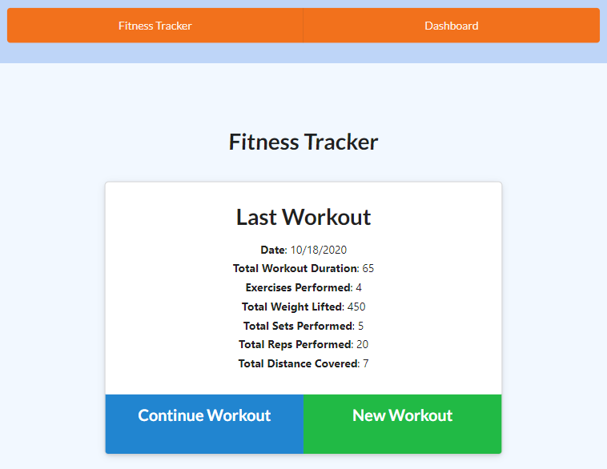

# MongoDB Fitness Tracker

 

  ## Description:

  An app using Express, Mongoose, and mongoDB to track fitness progress over time. Users can input their fitness data, tracking workouts and exercises within those workouts, which will be stored in a NoSQL database.

The Mongoose schema has Exercises as a populated field in Workouts. Additionally, I used Mongoose's discriminator mechanism to inherit and extend Exercise attributes.

I also used Mongoose's virtual attribute function to calculate total duration for the homepage.

*[Link to Gist Writeup of Project](https://gist.github.com/GAFelton/df2a55136daf8b2aef22996f284bb673)*

  [Link to Deployed Project](https://nameless-tundra-41076.herokuapp.com/) || [Link to GitHub Repo](https://github.com/GAFelton/fitness-tracker-mongodb)

  ## Table of Contents

 * [Installation](#Installation)
 * [Usage](#Usage)
 * [License](#License)
 * [Contributing](#Contributing)
 * [Questions](#Questions)

  

  ## Installation

1. Clone this [repo](https://github.com/GAFelton/fitness-tracker-mongodb).
2. Set up your local MongoDB URI inside a .env file. My .env file contained:`MONGODB_URI=mongodb://localhost:27017/fitnessTrackerDB`
3. Use your preferred method to establish environmental variables - I used VSCode's built-in launch configurations with the added parameter `"envFile": "${workspaceFolder}/.env"`.
4. Launch your app with `npm start` or `node server.js`.

> A Note: Hosting with Heroku takes a few more steps. You can find more instructions on [how to set up Heroku here](https://devcenter.heroku.com/articles/preparing-a-codebase-for-heroku-deployment), and [how to connect your MongoDB Atlas cloud db with Heroku](https://dev.to/cpclark360/how-to-host-a-restful-node-js-server-with-mongodb-atlas-database-on-heroku-1opl).

  ## Usage

  Create a new workout or add to an existing one.

  Each exercise can be either cardio or resistance.

  View your progress over time on the dashboard and current stats on the homepage.

  ## License

  MIT

  

  ## Contribution Guidelines

  Please let me know how I can improve on this project! Issues and pull requests are welcome.

  ## Questions

  Please address questions to GAFelton.

  [Link to Profile](https://github.com/GAFelton)

  [E-mail](64555318+GAFelton@users.noreply.github.com)

